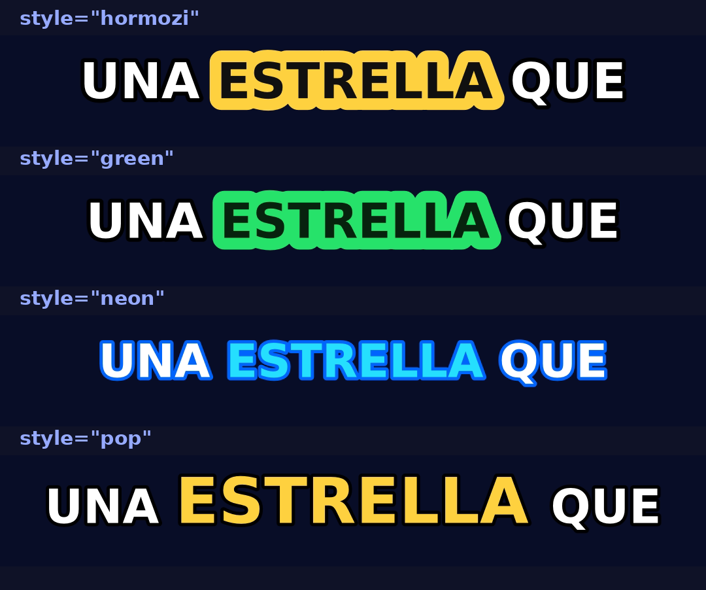

# captionwave

Genera **audio (voz)** y **subtítulos animados sincronizados** (`.ass` + `.srt`) a partir de una variable de texto. Pensado para Shorts / Reels / TikTok estilo "¿Sabías que…?".

La librería **no arma el video final**: te entrega los archivos (audio + subtítulos + emojis con tiempos) para que tú montes el video como prefieras (FFmpeg, tu editor, MoviePy…). Así tienes control total y no reprogramas los subtítulos en cada proyecto.

- ✅ Voz con **edge-tts** y tiempos **por palabra** → el audio y los subtítulos quedan pegados *por construcción* (no se desfasan).
- ✅ Subtítulos animados en **`.ass`** (karaoke, palabra activa, "pop", sticker estilo Hormozi, palabra-por-palabra…) que **FFmpeg/libass renderiza de forma nativa** (rápido).
- ✅ `.srt` de respaldo para plataformas que no aceptan `.ass`.
- ✅ **Emojis filtrados a los que existen en iOS** (sin "tofus"/cuadritos), con sus tiempos exportados para superponer tu propio arte.

---

## Instalación

```bash
pip install captionwave
```

O desde el código fuente, para desarrollo:

```bash
pip install -e .
```

Requisitos:
- **Conexión a internet** para la voz (edge-tts usa el servicio de Microsoft Edge). Si solo quieres los subtítulos a partir de tiempos que ya tienes, puedes trabajar sin red con `build_from_words(...)` (ver más abajo y `examples/offline_sin_internet.py`).
- **FFmpeg** instalado si vas a quemar los subtítulos en el video (`ffmpeg -version`).
- Opcional, recomendado: `pip install captionwave[duration]` (usa *mutagen* para medir con exactitud la duración del audio y alinear el último subtítulo).

---

## Uso rápido

```python
from captionwave import CaptionGenerator

gen = CaptionGenerator(
    voice="es-MX-DaliaNeural",   # cualquier voz de edge-tts
    rate="+18%",                 # más rápido = más dinámico
    style="hormozi",             # ver estilos abajo
)

r = gen.generate(
    "El Sol es una estrella que contiene el 99% de la masa del sistema solar.",
    out_audio="voz.mp3",
    out_ass="subs.ass",
    out_srt="subs.srt",          # opcional
    out_emojis="emojis.json",    # opcional (para superponer arte de emoji)
)

print(r["duration"], "segundos")
```

Esto crea `voz.mp3`, `subs.ass`, `subs.srt` y `emojis.json`, listos para montar.

### Con un gancho/intro a otro ritmo

```python
r = gen.generate(
    "el sol es una estrella enorme.",
    intro="¿Sabías que...?",   # se dice antes
    intro_rate="+5%",          # el gancho un poco más pausado
    out_audio="voz.mp3", out_ass="subs.ass",
)
```

### Sin internet (a partir de tiempos que ya tienes)

Si ya tienes los tiempos por palabra (de otra fuente o para hacer pruebas),
puedes generar los subtítulos **sin TTS ni conexión** con `build_from_words`:

```python
from captionwave import CaptionGenerator

words = [
    {"word": "El",       "start": 0.00, "dur": 0.18},
    {"word": "Sol",      "start": 0.18, "dur": 0.34},
    {"word": "es",       "start": 0.52, "dur": 0.16},
    {"word": "una",      "start": 0.68, "dur": 0.18},
    {"word": "estrella", "start": 0.86, "dur": 0.52},
]

gen = CaptionGenerator(style="hormozi")
r = gen.build_from_words(words, duration=1.5, out_ass="subs.ass", out_srt="subs.srt")
```

Devuelve el mismo `dict` que `generate` (con `audio=None`). Ver `examples/offline_sin_internet.py`.

---

## Estilos disponibles



*(Palabra activa "ESTRELLA" resaltada en 4 de los estilos. El resaltado avanza palabra por palabra al ritmo de la voz.)*

```python
from captionwave import list_styles
print(list_styles())
```

| Estilo      | Animación        | Descripción |
|-------------|------------------|-------------|
| `hormozi`   | sticker amarillo | Palabra activa con fondo sólido (clásico de Shorts). |
| `green`     | sticker verde    | Igual que hormozi pero en verde. |
| `karaoke`   | barrido          | El texto se "llena" de color al ritmo de la voz. |
| `pop`       | rebote           | La palabra activa crece y cambia de color. |
| `fire`      | rebote naranja   | Variante de `pop` en tono fuego. |
| `neon`      | color + glow     | Palabra activa cian con contorno azul. |
| `single`    | palabra única    | Una sola palabra a la vez, grande y centrada. |
| `clean`     | color suave      | Subtítulo abajo, sobrio (lower third). |

### Personalizar cualquier estilo

Cada estilo es un `Style` que puedes copiar y modificar:

```python
from captionwave import get_style, CaptionGenerator

mi_estilo = get_style("hormozi").copy(
    active_color="#FF3366",
    sticker_color="#FF3366",
    sticker_text_color="#FFFFFF",
    font="Montserrat",     # debe estar instalada en el sistema que renderiza
    font_size=96,
    max_words=2,           # menos palabras por línea
    position="lower",      # "center" | "lower" | "upper"
)

gen = CaptionGenerator(style=mi_estilo, rate="+20%")
```

Campos útiles de `Style`: `base_color`, `active_color`, `outline_color`, `outline_w`, `sticker_color`, `sticker_text_color`, `sticker_bord`, `pop_scale`, `font`, `font_size`, `uppercase`, `max_words`, `max_chars`, `position`.

---

## Montar el video con FFmpeg

La librería te da `voz.mp3` + `subs.ass`. Para quemar los subtítulos sobre un fondo:

**Sobre un video de fondo** (gameplay, b-roll, etc.):
```bash
ffmpeg -i fondo.mp4 -i voz.mp3 \
  -vf "scale=1080:1920,ass=subs.ass" \
  -map 0:v -map 1:a -shortest salida.mp4
```

**Sobre una imagen fija**:
```bash
ffmpeg -loop 1 -i fondo.jpg -i voz.mp3 \
  -vf "scale=1080:1920,ass=subs.ass" \
  -c:v libx264 -pix_fmt yuv420p -c:a aac -shortest salida.mp4
```

> El `.ass` ya trae la resolución (1080×1920 por defecto). Si cambias la resolución usa `resolution=(W, H)` en `CaptionGenerator`.

---

## ⚠️ Sobre los emojis (léelo)

La librería elige, para cada palabra/frase, un **emoji que sí existe en iOS** (filtra por versión de Unicode; ajustable con `emoji_max_version`). Esto evita que en un iPhone aparezcan cuadritos.

Dos cosas importantes sobre la **apariencia**:

1. **No se incluye el arte de Apple.** Los emojis de Apple son propiedad de Apple y no se pueden empaquetar/redistribuir. La librería entrega el **carácter Unicode** correcto; el diseño con el que se ve lo pone el sistema donde se reproduce (en iPhone/Mac se verá con el estilo de Apple; en Linux con Noto/Twemoji).

2. **libass no garantiza emojis a color.** Al quemar el `.ass` con FFmpeg, los emojis suelen salir **monocromos**. Por eso, si quieres el emoji a color (y con el look de Apple), la mejor ruta es **superponerlo como imagen** en tu editor o con FFmpeg, usando los tiempos que te da la librería:

```python
r = gen.generate("...", out_emojis="emojis.json")
for e in r["emojis"]:
    print(e)  # {"word": "estrella", "emoji": "⭐", "start": 1.38, "dur": 0.58}
```

Con eso colocas tu PNG de emoji (que tú aportas) en `start` durante `dur`. Así el carácter sale de la librería y el arte lo pones tú, sin problemas de copyright.

Si prefieres incrustar el carácter directamente en el `.ass` de todas formas, está activado por defecto (`emoji_in_ass=True`); ponlo en `False` si vas a usar overlay.

> 💡 Para **emojis a color** (sin cuadritos) en el video, mira el ejemplo
> [`examples/emojis_a_color_mp4.py`](examples/emojis_a_color_mp4.py): genera los
> subtítulos con `emoji_in_ass=False` y superpone cada emoji como PNG a color.

El emoji de cada palabra sale de un **diccionario curado extenso** (cientos de
palabras en español). Puedes consultarlo directamente:

```python
from captionwave import emoji_for_word
emoji_for_word("estrella")   # -> "⭐"
emoji_for_word("planeta")    # -> "🪐"
```

---

## Qué devuelve `generate(...)`

Un `dict` con:

```python
{
  "audio": "voz.mp3",
  "ass":   "subs.ass",
  "srt":   "subs.srt" | None,
  "duration": 6.37,                 # segundos
  "words":  [{"word","start","dur"}, ...],
  "lines":  [{"text","start","end","emoji"}, ...],
  "emojis": [{"word","emoji","start","dur"}, ...],
}
```

---

## Desarrollo y tests

```bash
pip install -e ".[test]"
pytest
```

Los tests **no necesitan internet** (no llaman al TTS): cubren los estilos, el
troceado en líneas, la selección de emojis y la escritura de `.ass`/`.srt`.

---

## Licencia

MIT © 2026 Wilfredo Guillén — ver [LICENSE](LICENSE).
